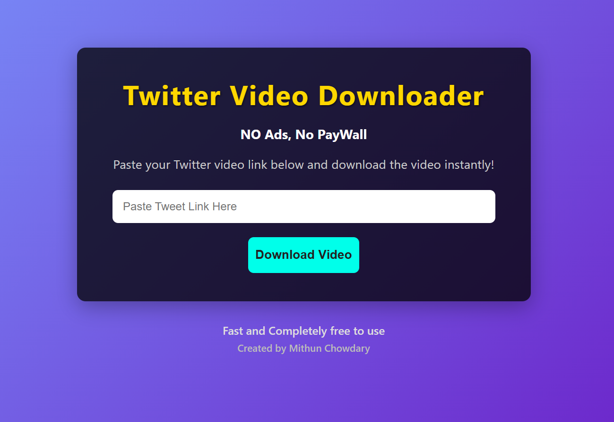

# 🐦 Twitter Video Downloader

A clean, fast, and ad-free web application to download Twitter videos by simply pasting the Tweet link.

## ✨ Features

- 🚫 No Ads, No Paywall
- 💾 Download videos directly from Twitter links
- ⚡ Fast, responsive interface
- 🎨 Simple UI with clean design
- 📱 Mobile-friendly
- 💻 Built with Flask and yt-dlp

## 📸 Preview

  
_Add a screenshot of your app here after deploying_


## 🛠️ Tech Stack

- Python 3
- Flask
- yt-dlp (video downloading)
- HTML/CSS (with custom styling)

## 📦 Installation

1. **Clone the repository**

```bash
git clone https://github.com/MithunChowdary/twitter-video-downloader.git
cd twitter-video-downloader

Create and activate a virtual environment

python -m venv venv
# On Windows
.\venv\Scripts\activate
# On Mac/Linux
source venv/bin/activate
Install dependencies

pip install -r requirements.txt
Run the app

python app.py
Open your browser and go to http://127.0.0.1:5000

📁 Project Structure

twitter-video-downloader/
│
├── static/
│   ├── style.css
│   └── favicon-32x32.png
├── templates/
│   └── index.html
├── app.py
├── requirements.txt
└── README.md

📌 Notes

Downloads are saved temporarily on the server and served back to the user.
Ensure yt-dlp is up to date if Twitter changes its video logic.

📤 Deployment

You can deploy this app easily to:
Vercel (using Flask adapter and Vercel CLI)
Render, Railway, or Fly.io

🙋‍♂️ Author
Made with ❤️ by Mithun Chowdary


📝 License
This project is licensed under the MIT License.

Let me know if you want to add badges, GIF demos, or Vercel-specific setup instructions.


